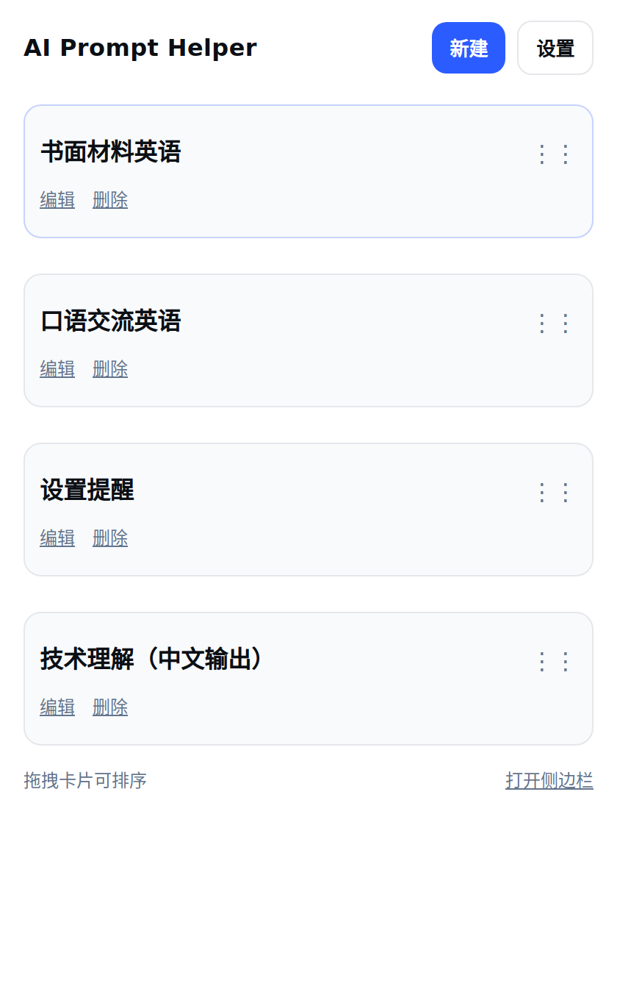
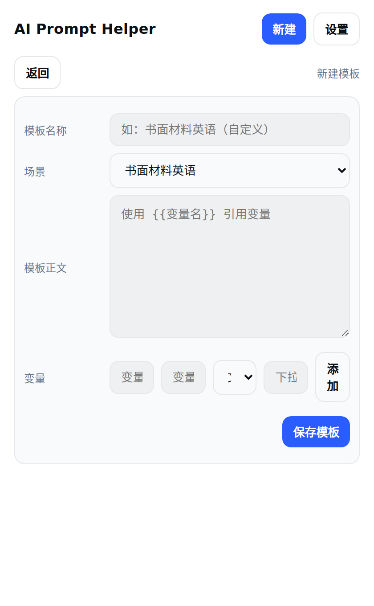
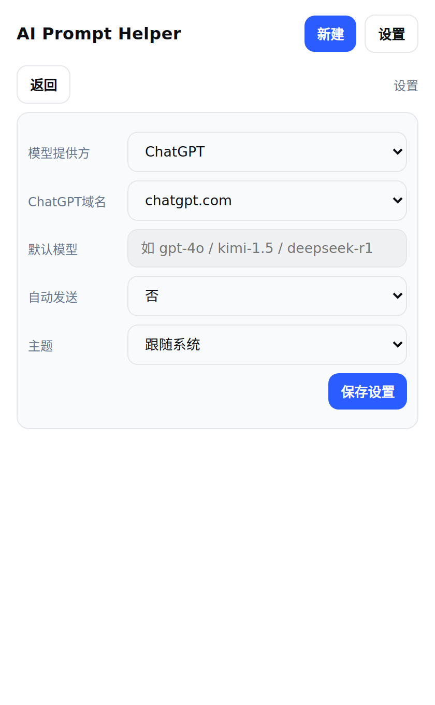

Hello world

### AI Prompt Helper 扩展

- 这是一个兼容 Chrome/Edge 的 MV3 插件，用于预置高质量 Prompt 模板并快速插入到 ChatGPT/Kimi/DeepSeek。

### 安装
- 打开浏览器扩展管理，启用“开发者模式”
- 选择“加载已解压的扩展程序”，指向 `ai-prompt-helper-extension` 目录，或导入根目录下的压缩包 `ai-prompt-helper-extension.zip`

### 主要功能
- 弹窗与侧边栏两种形态，浅色/深色自适应
- 首页卡片视图（可拖拽排序），点击进入模板详情
- 详情页支持：清空、复制、插入、插入并发送
- “临时对话”选项（ChatGPT）：跳转并发送至 `https://chatgpt.com/?temporary-chat=true`
- 模板管理：自定义模板与变量（文本/多行/下拉）
- 设置页面：配置提供方、域名、默认模型、自动发送、主题偏好
- 自动识别 ChatGPT/Kimi/DeepSeek，并注入到输入框；修复插入与自动发送

### 截图（实际截图）

  

    
<strong>首页卡片</strong>

    
  

  

    
<strong>模板详情</strong>

    
  

  

    
<strong>新建模板</strong>

    
  

  

    
<strong>设置页面</strong>

    
  

### 版本更新
- 1.1.1
  - 修复注入逻辑（临时对话重试与错误提示），按钮 toast 提示
  - 首页卡片操作改为链接样式，新增“打开侧边栏”
  - 详情页按钮移至预览标题行，变量表单分行显示
  - 深色模式下输入控件背景与对比度修复
- 1.1.0
  - 全新首页卡片 + 拖拽排序
  - 详情：清空/复制/插入/插入并发送
  - 修复 ChatGPT/Kimi/DeepSeek 插入与自动发送；新增 `chatgpt.com` 支持
  - 新增“临时对话”选项（ChatGPT）
  - 新增“设置与模板管理”页面
  - 统一字体与控件视觉，优化 hover/press 细节

分支：`feature/ai-prompt-helper-extension`
产物：`/workspace/ai-prompt-helper-extension.zip`
