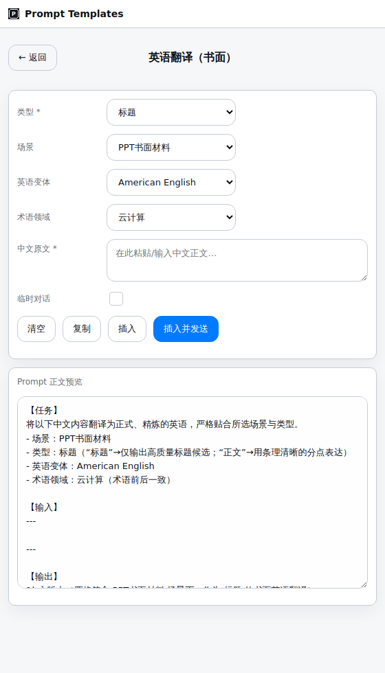
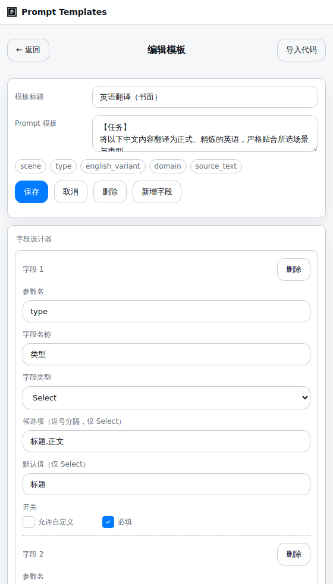
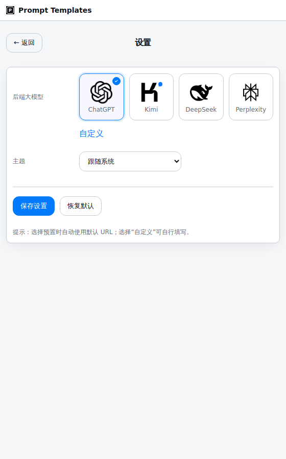
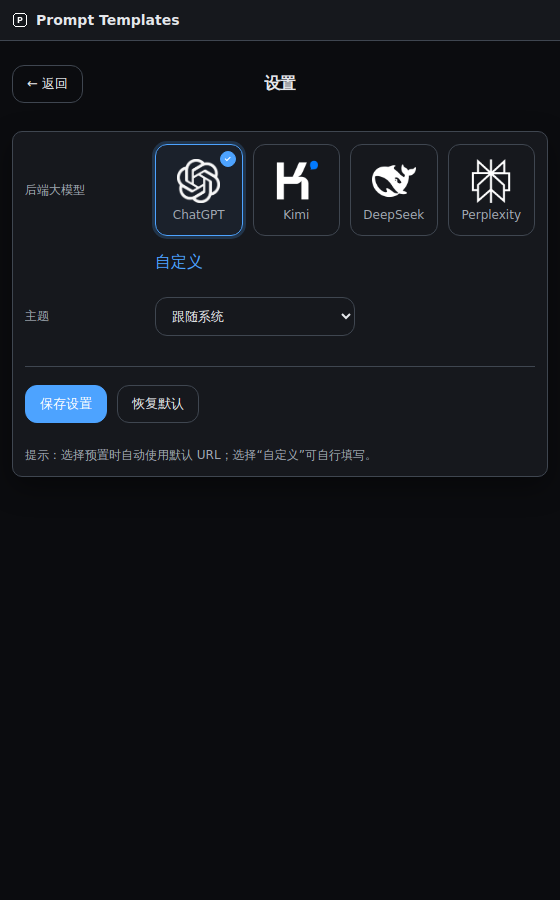

## Prompt Templates 浏览器扩展

一个用于快速管理与应用 Prompt 模板的浏览器扩展（v2.12.2.1）。支持模板参数化、侧边栏面板、JSON 导入、以及在 ChatGPT/Kimi/DeepSeek/Perplexity 等站点的稳健注入与可选一键发送。

### 核心功能
- **模板库与搜索**: 弹出页展示模板卡片，支持搜索与点击进入填充。
- **模板编辑器**: 编辑标题与正文，自动识别占位符 {{key}} 并高亮展示。
- **字段设计器**: 图形化定义字段（Text/Textarea/Select），支持默认值、必填与“自定义”选项。
- **JSON 导入**: 粘贴 JSON 一键解析并填充模板与字段。
- **结果预览/生成**: 实时预览替换后的 Prompt，自动去除未赋值占位符与多余空行；支持按场景过滤“若为 …”分支语句。
- **一键插入/发送**: 将生成文本自动写入目标站点输入框，可选择直接发送；支持打开临时会话。
- **侧边栏支持**: 优先打开 Edge/Chrome 侧边面板；若不可用自动回退为独立弹窗。
- **主题与提供商设置**: 切换 ChatGPT/Kimi/DeepSeek 预设与常规/临时会话 URL，自定义主题（系统/浅色/深色）。

### 适用站点
- ChatGPT: `https://chatgpt.com/*`、`https://chat.openai.com/*`
- Kimi: `https://www.kimi.com/*`、`https://kimi.moonshot.cn/*`
- DeepSeek: `https://chat.deepseek.com/*`
- Perplexity: `https://www.perplexity.ai/*`

### 使用方式（本地开发/调试）
1. 浏览器打开“扩展程序”页面，开启“开发者模式”。
2. 选择“加载已解压的扩展程序”，指向目录 `edge-prompt-templates`（内含 `manifest.json`）。
3. 通过工具栏图标打开弹出页，或从菜单打开侧边栏面板进行使用。

### 打包与发布（CI）
- 工作流：`.github/workflows/package-edge-templates.yml`
- 手动触发（可选创建 Release）：在 Actions 中运行该工作流，设置 `release=true` 则会基于 `manifest.json` 的版本创建 tag 与 Release，并上传 `edge-prompt-templates-v<version>.zip`。
- 按 tag 触发：推送 `v*` 标签也会打包并上传 artifact。

### 目录结构（关键文件）
- `edge-prompt-templates/manifest.json`: 扩展清单
- `edge-prompt-templates/popup.html`: 弹出页 UI
- `edge-prompt-templates/panel.html`: 侧边栏 UI（或弹窗回退）
- `edge-prompt-templates/scripts/popup.js`: 模板管理、渲染与注入调用逻辑
- `edge-prompt-templates/scripts/background.js`: 标签页管理与跨页注入
- `edge-prompt-templates/scripts/content.js`: 站点内查找输入框并写入/触发发送

### 版本
- 当前版本：`2.12.2.1`

### 打包到 dist
- 运行 Actions 工作流 “Build dist package” 生成 dist 下的版本化压缩包；或使用分支内的 dist 目录下载最新 zip。

### 截图（浅色 / 深色）
首页（弹窗）

  
  

模板详情（弹窗）

  
  

新建/编辑（弹窗）

  
  

设置（弹窗）

  
  

