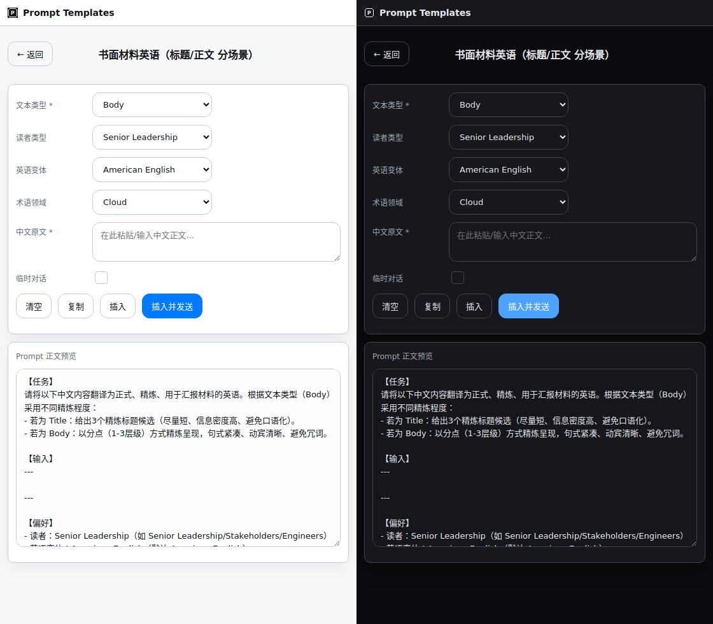
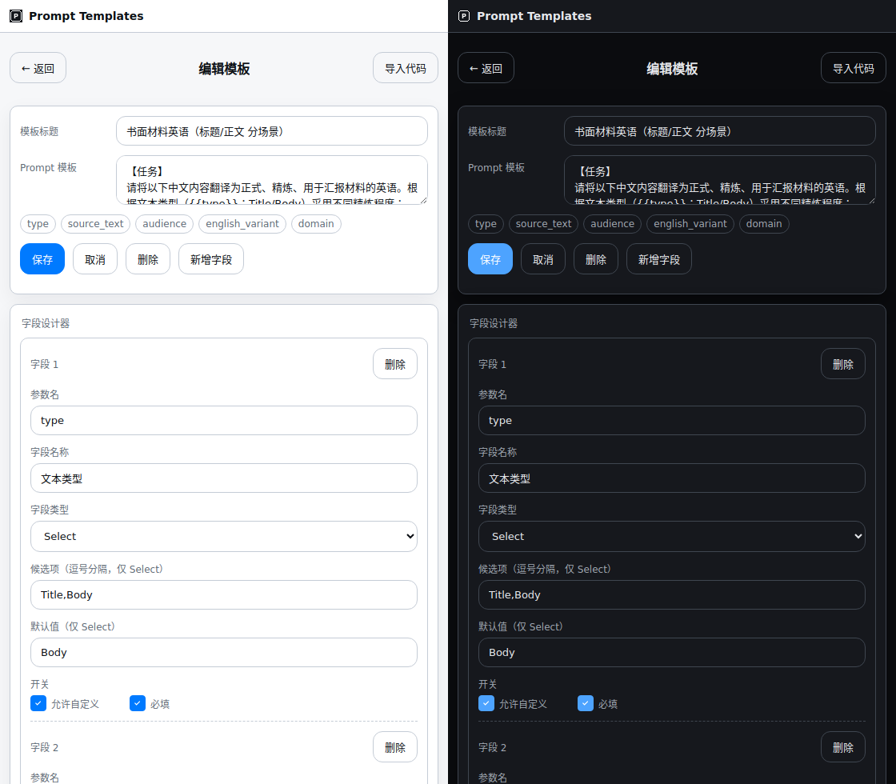
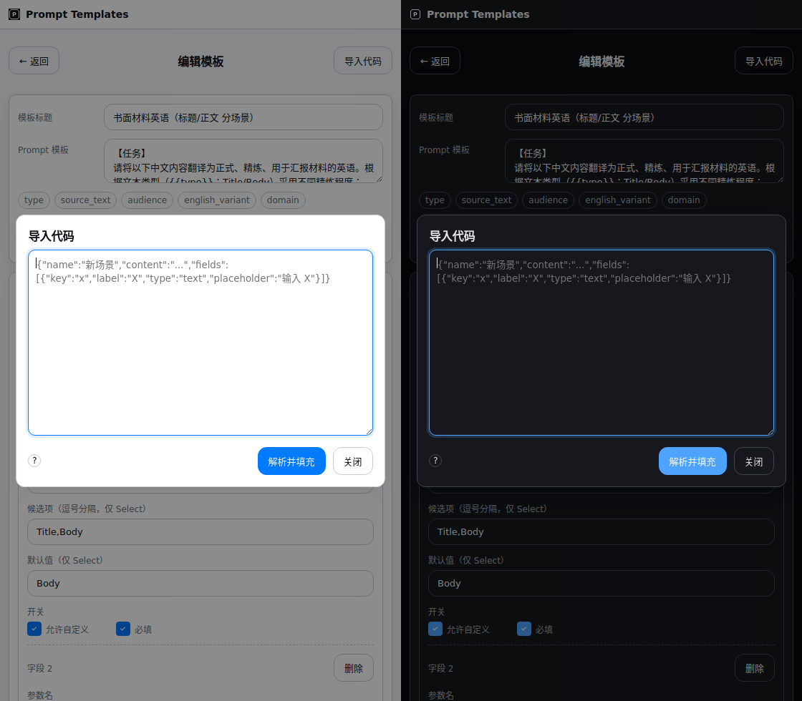
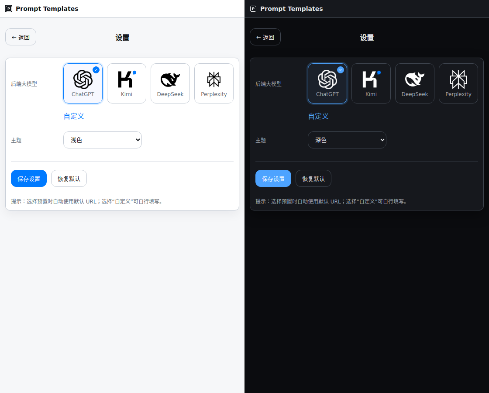

## Prompt Templates 浏览器扩展

一个用于快速管理与应用 Prompt 模板的浏览器扩展（v2.11.13.2）。支持模板参数化、侧边栏面板、JSON 导入、以及在 ChatGPT/Kimi/DeepSeek/Perplexity 等站点的稳健注入与可选一键发送。

### 核心功能
- **模板库与搜索**: 弹出页展示模板卡片，支持搜索与点击进入填充。
- **模板编辑器**: 编辑标题与正文，自动识别占位符 {{key}} 并高亮展示。
- **字段设计器**: 图形化定义字段（Text/Textarea/Select），支持默认值、必填与“自定义”选项。
- **JSON 导入**: 粘贴 JSON 一键解析并填充模板与字段。
- **结果预览/生成**: 实时预览替换后的 Prompt，自动去除未赋值占位符与多余空行；支持按场景过滤“若为 …”分支语句。
- **一键插入/发送**: 将生成文本自动写入目标站点输入框，可选择直接发送；支持打开临时会话。
- **侧边栏支持**: 优先打开 Edge/Chrome 侧边面板；若不可用自动回退为独立弹窗。
- **主题与提供商设置**: 切换 ChatGPT/Kimi/DeepSeek 预设与常规/临时会话 URL，自定义主题（系统/浅色/深色）。

### 适用站点
- ChatGPT: `https://chatgpt.com/*`、`https://chat.openai.com/*`
- Kimi: `https://www.kimi.com/*`、`https://kimi.moonshot.cn/*`
- DeepSeek: `https://chat.deepseek.com/*`

### 使用方式（本地开发/调试）
1. 浏览器打开“扩展程序”页面，开启“开发者模式”。
2. 选择“加载已解压的扩展程序”，指向目录 `edge-prompt-templates`（内含 `manifest.json`）。
3. 通过工具栏图标打开弹出页，或从菜单打开侧边栏面板进行使用。

### 打包与发布（CI）
- 工作流：`.github/workflows/package-edge-templates.yml`
- 手动触发（可选创建 Release）：在 Actions 中运行该工作流，设置 `release=true` 则会基于 `manifest.json` 的版本创建 tag 与 Release，并上传 `edge-prompt-templates-v<version>.zip`。
- 按 tag 触发：推送 `v*` 标签也会打包并上传 artifact。

### 权限说明（Manifest V3）
- `permissions`: `storage`、`activeTab`、`scripting`、`tabs`
- `host_permissions`: ChatGPT/Kimi/DeepSeek 站点 URL
- `content_scripts`: 在上述站点空闲阶段注入 `scripts/content.js`
- `background`: `scripts/background.js`（Service Worker）
- `content_security_policy.extension_pages`: `script-src 'self'; object-src 'self'`

### 目录结构（关键文件）
- `edge-prompt-templates/manifest.json`: 扩展清单
- `edge-prompt-templates/popup.html`: 弹出页 UI
- `edge-prompt-templates/panel.html`: 侧边栏 UI（或弹窗回退）
- `edge-prompt-templates/scripts/popup.js`: 模板管理、渲染与注入调用逻辑
- `edge-prompt-templates/scripts/background.js`: 标签页管理与跨页注入
- `edge-prompt-templates/scripts/content.js`: 站点内查找输入框并写入/触发发送

### 版本
- 当前版本：`2.12.1.4`

### 打包到 dist
- 运行 Actions 工作流 “Build dist package”，可在 dist 下生成版本化压缩包，并作为 Artifact 提供下载；勾选 `release=true` 可自动创建 Release 并上传该 zip。

#### 2.11.2 变更
- 设置页改为“服务提供商卡片”选择：ChatGPT/Kimi/DeepSeek/Perplexity/自定义。仅“自定义”显示 URL 输入。
- 新增 Perplexity 预置支持并扩展权限与注入识别域名。
- 侧边栏编辑器样式与交互与弹窗同步（导入代码弹窗、问号帮助、焦点与样式一致）。

#### 2.11.1.2 变更
- 导入弹窗：新增“问号”帮助按钮（左侧、垂直居中），悬浮提示“复制样例代码”；点击复制包含 text/textarea/select 三种类型说明的样例 JSON，便于直接发给 ChatGPT 生成模板。
- 编辑器：字段编辑器按类型动态显隐（Select 显示“候选项/默认值”，Text/Textarea 显示“提示词”）。
- UI：编辑器样式梳理，顶部右侧移入“导入代码”按钮并使用遮罩弹窗承载导入流程。
- 稳定性：插入/发送流程即时反馈“处理中…”，并优化标签激活与临时会话优先级逻辑。

#### 2.4.9 变更
- 修复：在浏览器主页面失焦时“插入/插入并发送”不稳定问题；扩大编辑器选择器并仅在可编辑时使用 activeElement 兜底，移除会导致白屏的写入回退。
- 修复：浅色主题下滚动条与复选框底色偏深；统一滚动条与复选框样式与对焦态。
- 修复：编辑页面“开关”区域复选框与文字未垂直居中；使用 inline-flex 居中。
- 修复：视图切换后首页滚动条不消失；规范容器 overflow 与页面高度。
- 构建：新增 GitHub Actions 工作流 `package-edge-templates.yml`，仅打包 `edge-prompt-templates`，支持手动触发与按 tag 触发，可选自动创建 Release。

### 截图（示例尺寸与说明）
- 弹出页尺寸：宽 560px（以下截图均按真实弹窗宽度）
- 首页（模板库/搜索）：560×860 PNG
- 模板详情页（填充/预览/插入按钮）：560×980 PNG
- 新建/编辑页面（字段设计器）：560×980 PNG
- 设置页（提供商与主题）：560×900 PNG

#### 示例截图（弹窗尺寸）
- 首页（左：浅色｜右：深色）：`assets/home-popup.png`
- 模板详情页（左：浅色｜右：深色）：`assets/detail-popup.png`
- 新建/编辑页（左：浅色｜右：深色）：`assets/edit-popup.png`
- 代码导入弹窗（左：浅色｜右：深色）：`assets/edit-import-popup.png`
- 设置页（左：浅色｜右：深色）：`assets/settings-popup.png`

  
<strong>首页（弹窗）</strong>

  
  
<strong>模板详情页（弹窗）</strong>

  
  
<strong>新建/编辑页（弹窗）</strong>

  
  
<strong>代码导入弹窗（弹窗）</strong>

  
  
<strong>设置页（弹窗）</strong>

  

